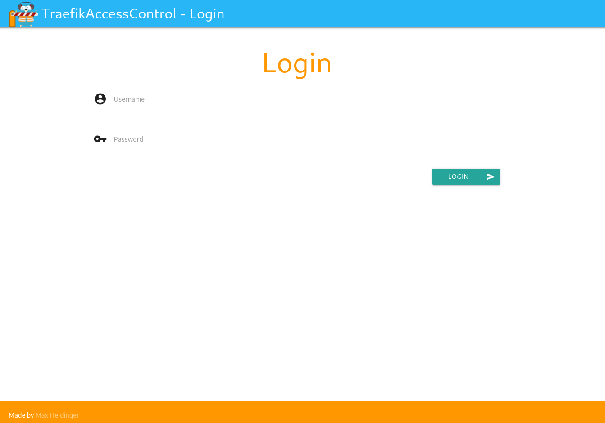
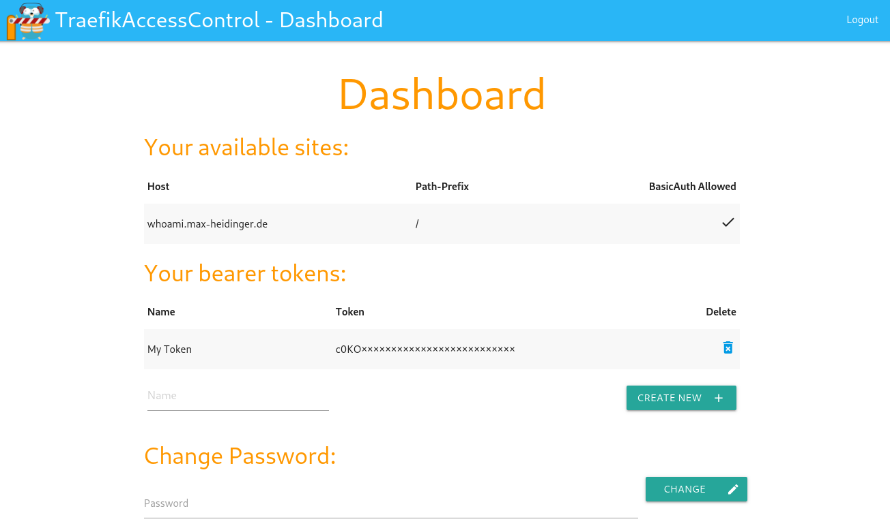

# TraefikAccessControl


#### TraefikAccessControl is a small server application providing a ForwardAuth source for Traefik and is configurable on a per user and URL basis.

Login                      |  User Dashboard
:-------------------------:|:-------------------------------:
 |  

## Installation

### Docker

Docker images are available on [Docker Hub](https://hub.docker.com/r/mheidinger/traefik-access-control).

The default database path inside the docker container is `/app/tac.db`.

### Compiling and running locally

For compiling the source, first download all dependencies:
```
go mod download
```

After that the compilation and execution can be done via the Makefile:
```
make
make run
```

To generate and automatically import some test data (generated in `testData.go`) run the following:
```
make run-import
```

A cleanup of the database and the generated test data is also possible:
```
make clean
```

## Usage

```
./TraefikAccessControl -help

Usage of ./TraefikAccessControl:
  -cookie_name string
        Cookie name used (default "tac_token")
  -db_name string
        Path of the database file (default "tac.db")
  -force_import
        Force the import of the given file, deletes all existing data
  -import_name string
        Path of an file to import
  -port int
        Port on which the application will run (default 4181)
  -user_header_name string
        Header name that contains the username after successful auth (default "X-TAC-User")
```

### Traefik configuration (version 2.0)

```
[http.middlewares.tac-auth.forwardAuth]
		address = "https://your_tac_url/access"
		authResponseHeaders = ["X-TAC-User"]
```

This configuration will forward the header (`-user_header_name`) with the username to the requested service. 
